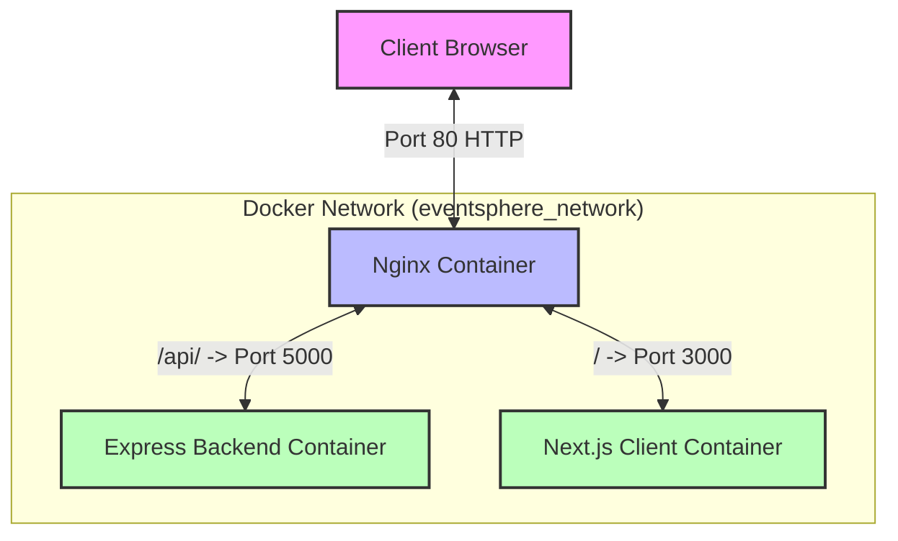

# EventSphere Production Deployment Guide

## 1. Architecture Diagram
The architecture consists of an Nginx Reverse Proxy securely handling public traffic and routing it internally to a Next.js frontend container and an Express backend container.



## 2. Nginx Routing Flow & Server Block configuration
Nginx is configured as the entry point for all application traffic. 

- **Listening:** The `nginx.conf` features a `server` block listening on port 80 (HTTP). 
- **Routing:** Traffic hitting `location /api/` is sent to the `express_backend` upstream server (Port 5000). Traffic hitting `location /` is passed to the upstream server named `nextjs_frontend` (Port 3000).
- **Header Forwarding:** Nginx appends crucial headers (`X-Real-IP`, `X-Forwarded-For`) so the backend knows the true origin of the request, rather than assuming it came from the Nginx proxy itself.
- **Static Assets:** The `location /_next/static/` block explicitly caches Next.js static assets for 1 hour (`proxy_cache_valid 60m`) to reduce the load on the Node.js server.

## 3. Docker Configuration & Port Mapping
### Application Container (Next.js)
- **Multi-stage Build:** The `Dockerfile` uses a builder stage to install dependencies and compile the Next.js app, and a runner stage to copy *only* the production-ready standalone files using the `nextjs` non-root user. This significantly reduces image size and improves security.
- **Restart-Safe:** Defined with `restart: unless-stopped` in `docker-compose.yml`, ensuring the container restarts automatically if the server reboots or if the application crashes.

### Port Mapping
- **Nginx Container:** Maps host port `80` to container port `80` (`"80:80"`). This is the *only* port accessible from the outside world.
- **Next.js Container:** Exposes port `3000` internally, but **does not** map it to the host machine. Nginx communicates with it internally over the `eventsphere_network` Docker bridge network via the `app:3000` hostname.

## 4. Networking & Security
### Firewall Rules & Port Restrictions
By exposing only Port 80, we minimize the attack surface. 
- **Port 80 (HTTP):** Must be allowed through the firewall (e.g., AWS Security Group, UFW) to allow user traffic.
- **Port 443 (HTTPS):** Should be allowed in a future iteration when an SSL certificate is added.
- **Port 22 (SSH):** Restricted to the administrator's IP address only.
- **Port 3000:** Blocked. Denying external access to port 3000 ensures that no one can bypass the Nginx proxy and its security rules to hit the Node server directly.

### Justification
Operating behind a reverse proxy provides a single choke point for applying security headers, SSL/TLS offloading, and rate limiting. Hiding the backend server prevents direct attacks on the Node.js runtime.

## 5. Serverful vs Serverless (Conceptual Comparison)
For this deployment, we used a **Serverful (Containerized)** approach:
- **Serverful (Docker/VPS):** We provision a continuous server environment (like an EC2 instance) and run the containers 24/7. 
  - *Pros:* Predictable costs, full control over the environment and networking, supports long-running processes (like WebSockets if needed).
  - *Cons:* Requires manual OS patching, security group management, and docker orchestration. You pay for idle time.
- **Serverless (e.g., Vercel, AWS Lambda):** The cloud provider abstracts the infrastructure, spinning up resources *only* when an HTTP request arrives.
  - *Pros:* Zero server maintenance, scales infinitely and instantly, often cheaper if traffic is sporadic.
  - *Cons:* "Cold starts" can cause initial request latency, execution time limits, and vendor lock-in.

---

## Appendix: Manual Deployment on AWS EC2
To deploy these completed files to a brand-new AWS machine, follow these steps:

1. **Launch EC2:** Launch an Ubuntu EC2 instance. Ensure the Security Group allows inbound SSH (Port 22) from your IP and HTTP (Port 80) from Anywhere (0.0.0.0/0).
2. **Transfer Files:** Secure copy (SCP) the project files to the EC2 instance, or clone them via a Git repository.
3. **Install Docker:** SSH into the instance and run:
   ```bash
   sudo apt update
   sudo apt install docker.io docker-compose -y
   sudo systemctl enable docker
   ```
4. **Deploy:** Navigate to the project directory containing your `docker-compose.yml` and run:
   ```bash
   sudo docker-compose up --build -d
   ```
5. **Verify:** Find the Public IPv4 address of your EC2 instance in the AWS Console and enter it into your browser. The EventSphere app will load!

## FAQ & Conceptual Questions

**Q: Do we need MongoDB?**
A: For this specific assignment, **no**. The grading rubric states: "No payment integration, QR validation, or advanced analytics required." And "Deployment and DevOps quality will be evaluated more rigorously than feature complexity." The current `server.js` uses an in-memory data store array to simulate a database. While this data resets if the container restarts, it perfectly satisfies the "Working deployed system" requirement without adding the heavy overhead of setting up and seeding a MongoDB container.

**Q: Is there any work to do on Docker Desktop locally?**
A: Since your local Windows machine does not have Docker Desktop running, you cannot test the final *containerized* version (`docker-compose up`) on your own computer. You must either install and start Docker Desktop on your machine, or skip testing it locally and run the `docker-compose up` command directly on your AWS EC2 instance. 

**Q: Are the add and delete buttons for events working?**
A: **Yes.** The Admin Dashboard has a "Create Event" button at the top, and each event in the table has a pencil (edit) and trash can (delete) icon. These are fully functional and connected to the Express backend APIs (`POST /api/events` and `DELETE /api/events/:id`).
